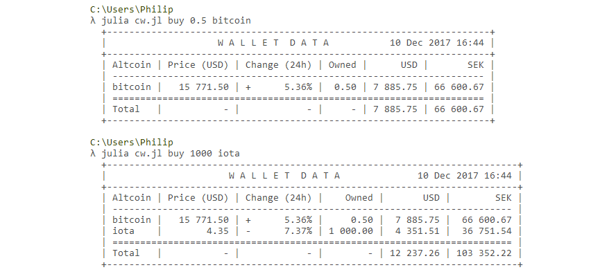
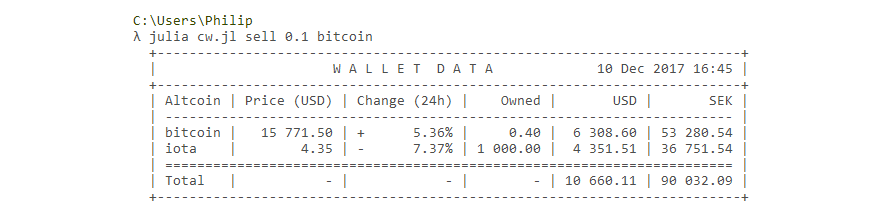

# What is this?

When I started actively investing/speculating in cryptocurrencies, I wanted a simple tool to keep track of the values of my investments. I came up with a script that downloads the latest ticker data from [CoinMarketCap](https://coinmarketcap.com/) and prints my cryptocurrency investments neatly in a simple table.

**NOTE: This is NOT an actual wallet—it does not manage your investments, it cannot transfer money and it has no access to your private keys. It only gives you an overview of your current investments!**

## Running the script

### Prerequisites
* [Julia](https://julialang.org/) — *A high-level dynamic programming language designed to address the needs of high-performance numerical analysis and computational science*

### Installation

The script depends on the [Requests](https://github.com/JuliaWeb/Requests.jl) package to function properly, so it must be installed first. Open a Julia [REPL](https://en.wikipedia.org/wiki/Read%E2%80%93eval%E2%80%93print_loop) and type the following:

`julia> Pkg.add("Requests")`

### Instructions

Below are instructions on how to use the script. Maybe sure you have installed all prerequisites before trying to run it.

#### Adding coins to your wallet

Invoke the script with the *buy* command to add coins to your wallet. For example, if you own 0.5 Bitcoin, add it to your wallet by typing `julia cw.jl buy 0.5 bitcoin`. The script will add 0.5 bitcoin to your wallet, save it to your wallet file and display your wallet contents. The wallet file is called wallet.json and will be stored together with the cw.jl script file.

#### Removing coins from your wallet

Much the same way you add coins, you can remove them with the *sell* command. Let's sell half of what we bought: `julia cw.jl sell 0.1 bitcoin`

#### Listing the contents of your wallet

Invoking the script without any commands shows the contents of your wallet: `julia cw.jl`

